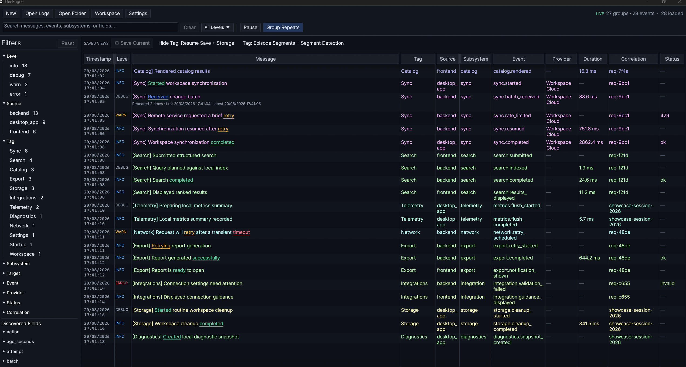

# DeeBugee

**Native structured-log debugging for Windows.**

Live-tail JSONL logs, search large event streams, filter structured fields, trace correlated events, and save reusable debugging workspaces.

DeeBugee is built with Rust, `egui`, and `wgpu`. It reads log files directly on your machine—no browser, WebView, HTTP server, database, cloud service, or listening port is required.



## Why DeeBugee?

Text logs become difficult to navigate when an application has multiple processes, subsystems, requests, and concurrent tasks. DeeBugee treats each JSONL line as a structured event, so you can find, filter, group, and inspect related activity without deploying a logging service or sending data elsewhere.

```text
Application → JSONL files → DeeBugee
                              ├─ Live tail
                              ├─ Search and facets
                              ├─ Correlation filtering
                              └─ Complete event details
```

## Highlights

- **Live tailing** — follow one or more append-only JSONL files in real time.
- **Structured filtering** — filter by level, source, feature tag, subsystem, event, correlation, and custom scalar fields.
- **Fast search** — fuzzy, multi-term search across messages and structured event data.
- **Large histories** — keep a responsive bounded view of up to 250,000 recent records.
- **Reusable debugging sessions** — save bookmarks, layouts, and TOML workspaces.
- **Native integrations** — produce compatible logs from Rust/Tauri, Electron, and .NET applications.

## Try it

### Windows portable executable

Download the [latest portable DeeBugee executable](https://github.com/JustApeasantCoder/DeeBugee/releases/latest), then run `dee-bugee.exe`. No installer or Rust toolchain is required. Open a JSONL file from the picker, drag one onto the window, or pass its path on the command line:

```powershell
.\dee-bugee.exe "C:\Logs\Application.jsonl"
```

### Build from source

Building from source requires Windows 10 or Windows 11 and a current stable Rust toolchain with Cargo. Clone, build, and open the included sample log:

```powershell
git clone https://github.com/JustApeasantCoder/DeeBugee.git
cd DeeBugee
cargo run --release -p dee-bugee -- .\tests\fixtures\sample.jsonl
```

This opens a representative structured log so you can immediately try search, facets, bookmarks, live-follow controls, and event inspection.

The built executable can run on Windows without Rust installed:

```text
target\release\dee-bugee.exe
```

To open your own JSONL file after building:

```powershell
.\target\release\dee-bugee.exe "C:\Logs\Application.jsonl"
```

You can also launch without a path to start with an empty workspace. DeeBugee does not silently reopen another project's logs. Use **Open JSONL** to select files, drag files onto the window, or open a previously saved workspace. Multiple files can be followed at the same time.

### Project workspaces

For project scripts and concurrent work, pass an explicit workspace file. DeeBugee opens the workspace when it exists, or creates it when it does not. The workspace owns that project's sources, filters, bookmarks, layout, and live-tail settings.

```powershell
.\dee-bugee.exe --workspace "C:\@My APPs\Project A\.deebugee\workspace.toml" --logs "C:\Users\you\AppData\Local\Project A\logs"
```

Subsequent launches can omit `--logs` and reuse the project-owned source set:

```powershell
.\dee-bugee.exe --workspace "C:\@My APPs\Project A\.deebugee\workspace.toml"
```

`--logs` accepts one path per occurrence; unflagged paths remain supported for compatibility with the original command-line form. An explicit `--logs` source set replaces the workspace's saved sources for that launch and is then saved back to that workspace.

## Using DeeBugee

### Search and filtering

Search terms use AND semantics across messages, event names, sources, subsystems, correlation values, optional schema properties, and structured `fields`. Terms do not need to be adjacent, and small typing mistakes are tolerated.

Facet controls provide fast structured filtering. Feature tags are derived consistently from bracketed message prefixes and subsystem names. Context prefixes such as `Settings`, `Frontend`, `Backend`, `Local`, and `Remote` do not replace the underlying feature, so `[Segment Detection][Local]` and `[Settings][WhisperLive]` remain grouped under `Segment Detection` and `WhisperLive` respectively.

- Left-click a value to include it in its facet.
- Ctrl+left-click additional values to combine them with OR semantics.
- Right-click a value to exclude it.
- Filters from different facets combine with AND semantics.
- Use the minimum-level selector to hide lower-severity events.

Save frequently used searches and facet combinations as bookmarks from the bar above the table. Saved views belong to the selected JSONL file or source set, so opening another log starts with its own views and reopening a log restores its views. Left-click a bookmark to restore it, Ctrl+Alt+left-click to replace it with the current filters, middle-click to rename it, and right-click to remove it.

### Table and live-follow controls

- Drag column headers to reorder them and edges to resize them.
- Use compact or wrapped messages, then select a row to inspect the full structured event.
- Pause and resume live following, and place the newest record at the top or bottom.
- Color related events by source, feature tag, subsystem, target, event, provider, or correlation.
- Set **Keep latest** to maintain a configurable bounded window without modifying source logs. Older rows remain stable while you inspect history.

Manual vertical scrolling pauses automatic following until you return to the latest edge. Horizontal scrolling does not interrupt vertical following. Layout, panel sizes, bookmarks, message wrapping, colors, and tail preferences are restored between launches.

### Workspaces and export

A saved TOML workspace records the open sources, filters, bookmarks, column order, color grouping, latest-record position, and log limit. Use workspaces to return to the same diagnostic setup later, keep projects isolated, or share a repeatable view with another developer.

Filtered records can be exported to a new JSONL file without modifying source logs.

## JSONL event format

DeeBugee reads one JSON object per line. Each event must contain `schema_version`, `timestamp`, `level`, `source`, `subsystem`, `event`, `message`, and `app_session_id`.

For readability, this is shown as formatted JSON below. In an actual `.jsonl` file, each event is serialized on one line.

```json
{
  "schema_version": 1,
  "timestamp": 1787202000000,
  "level": "info",
  "source": "desktop_app",
  "subsystem": "worker",
  "event": "job.completed",
  "message": "Background job completed",
  "app_session_id": "session-42",
  "request_id": "request-108",
  "duration_ms": 36.4,
  "status": "ok",
  "fields": {
    "items_processed": 24
  }
}
```

Supported levels are `trace`, `debug`, `info`, `warn`, `error`, and `fatal`. Timestamps may be Unix epoch milliseconds or RFC 3339 text. Additional properties are accepted, and scalar values inside `fields` automatically become filterable facets.

### Tags

`tag` is a viewer-derived facet, not a required JSONL property. DeeBugee derives it from the first meaningful bracketed message prefix, then falls back to `subsystem`. Context prefixes such as `Settings`, `Frontend`, `Backend`, `Local`, and `Remote` are ignored when a more specific feature follows them. For example, `[Search][Local] Results refreshed` is grouped under `Search`, while `[Settings][WhisperLive] Enabled` is grouped under `WhisperLive`.

You do not need to write a `tag` property. Use a consistent bracketed feature prefix in `message` when you want explicit grouping; the built-in Tag facet then keeps related frontend and backend events together automatically.

The complete contract is defined in [`schemas/event-v1.schema.json`](schemas/event-v1.schema.json).

## Integrating DeeBugee

The included adapters currently support local path-based integration.

### Rust and Tauri

Add the Rust adapter and `tracing-subscriber` as path dependencies:

```toml
[dependencies]
dee-bugee-rust = { path = "path/to/DeeBugee/crates/toolkit-rust" }
tracing-subscriber = { version = "0.3", features = ["registry"] }
```

Install the non-blocking `tracing` layer:

```rust
use dee_bugee_rust::{LoggerConfig, non_blocking_layer};
use tracing_subscriber::prelude::*;

let config = LoggerConfig::new(log_path, "backend");
let (deebugee_layer, logging_guard) = non_blocking_layer(config)?;

tracing_subscriber::registry()
    .with(deebugee_layer)
    .init();

tracing::info!(
    subsystem = "worker",
    event = "job.completed",
    request_id = request_id,
    duration_ms = elapsed.as_secs_f64() * 1000.0,
    "Background job completed"
);

// Keep logging_guard alive until application shutdown.
```

The same layer can be installed in a Tauri backend. Renderer events can be batched through a Tauri command and written through the shared adapter.

### Electron

Build the adapter before referencing it from an Electron application:

```powershell
cd adapters\electron
npm install
npm run build
```

In the main process, import Electron's `ipcMain`, choose a local log path, and install the writer:

```ts
import { app, ipcMain } from "electron";
import { join } from "node:path";
import { installElectronLogging } from "@deebugee/electron";

const logPath = join(app.getPath("userData"), "logs", "application.jsonl");
const writer = installElectronLogging(ipcMain, logPath);
```

Create a batched renderer logger in preload or another renderer bridge:

```ts
import { createRendererLogger } from "@deebugee/electron/renderer";

const logger = createRendererLogger(ipcRenderer, {
  appSessionId,
  source: "desktop_app",
});

logger.captureConsole();
logger.log("info", "window.ready", "Main window is ready", { duration_ms: 42.5 }, "interface");
```

### .NET

Reference `adapters/dotnet/DeeBugee.Extensions.Logging/DeeBugee.Extensions.Logging.csproj` from the consuming project, then register the provider:

```csharp
using DeeBugee.Extensions.Logging;
using Microsoft.Extensions.Logging;

using var factory = LoggerFactory.Create(builder =>
    builder.AddDeeBugee(new ToolkitLoggerOptions
    {
        Path = logPath,
        Source = "desktop_app"
    }));

var logger = factory.CreateLogger("worker");
logger.LogInformation(
    "Completed request {request_id} in {duration_ms} ms",
    requestId,
    elapsed.TotalMilliseconds);
```

## Build from source

Build the release executable from the repository root:

```powershell
cargo build --release -p dee-bugee
```

Node.js/npm and the .NET 8 SDK are only required when building their respective adapters or examples.

## Development

Use `RUN.bat` for local development:

```powershell
.\RUN.bat "C:\Logs\Application.jsonl"
```

It runs the debug build through the included development watcher. Saving Rust source changes recompiles and restarts the native viewer; this is the native-app equivalent of Vite hot reload. `RUN.bat` never changes the application version. Stop the reload loop with `Ctrl+C`.

### Validation

Run the complete Rust validation suite from the repository root:

```powershell
cargo fmt --all -- --check
cargo clippy --workspace --all-targets -- -D warnings
cargo test --workspace
```

Validate the Electron adapter:

```powershell
cd adapters\electron
npm install
npm test
```

Build the .NET adapter and example:

```powershell
dotnet build adapters\dotnet\DeeBugee.Extensions.Logging\DeeBugee.Extensions.Logging.csproj -c Release
dotnet build examples\csharp\CSharpExample.csproj -c Release
```

## Repository layout

```text
crates/toolkit-schema   Shared Rust event types
crates/toolkit-core     Bounded event store and bitmap facet indexes
crates/toolkit-viewer   Native viewer and JSONL follower
crates/toolkit-rust     Non-blocking tracing adapter and rotating writer
adapters/electron       Electron main-process and renderer adapter
adapters/dotnet         Microsoft.Extensions.Logging provider
schemas                 Language-neutral JSON Schema
examples                Integration examples
tests/fixtures          Test data
```

## License

DeeBugee is available under the [MIT License](LICENSE).
